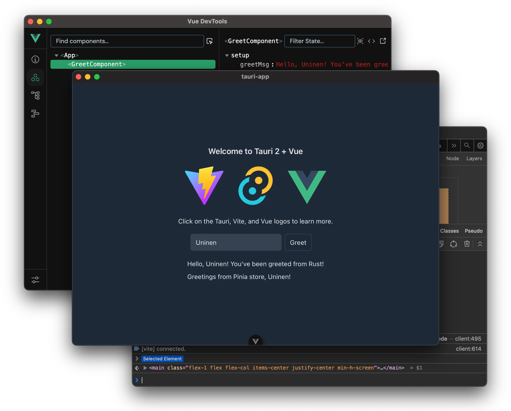

# تقویم من



تقویم من یک برنامه دسکتاپ مدرن و کاربرپسند است که با استفاده از Tauri و Vue 3 ساخته شده است. این برنامه به شما کمک می‌کند تا تاریخ‌ها را مشاهده کنید، یادآورها را مدیریت کنید و بین تاریخ‌های شمسی و میلادی تبدیل کنید. این برنامه با تمرکز بر سادگی و کارایی طراحی شده است.

## ویژگی‌ها

- **نمای سه‌گانه تاریخ**: مشاهده همزمان تاریخ‌های شمسی، میلادی و قمری.
- **مدیریت یادآورها**: ایجاد، ویرایش و حذف یادآورها با اعلان‌های دسکتاپ.
- **تبدیل تاریخ**: ابزار داخلی برای تبدیل تاریخ بین فرمت‌های مختلف.
- **حالت تاریک/روشن**: رابط کاربری قابل تنظیم با پشتیبانی از حالت تاریک و روشن.
- **رابط کاربری واکنش‌گرا**: تجربه کاربری یکپارچه در اندازه‌های مختلف صفحه نمایش.
- **اعلان‌های دسکتاپ**: دریافت اعلان‌ها برای یادآورهای برنامه‌ریزی شده.

## فناوری‌های استفاده شده

- **Tauri**: برای ساخت برنامه دسکتاپ کراس‌پلتفرم.
- **Vue 3**: فریم‌ورک پیشرو جاوااسکریپت برای ساخت رابط کاربری.
- **Pinia**: کتابخانه مدیریت وضعیت برای Vue.
- **Tailwind CSS**: فریم‌ورک CSS برای استایل‌دهی سریع و واکنش‌گرا.
- **TypeScript**: برای کدنویسی تایپ‌شده و قابل نگهداری.
- **Day.js**: کتابخانه سبک وزن تاریخ و زمان.

## نصب و راه‌اندازی

برای راه‌اندازی و اجرای پروژه به صورت محلی، مراحل زیر را دنبال کنید:

1.  **پیش‌نیازها**: اطمینان حاصل کنید که پیش‌نیازهای Tauri را نصب کرده‌اید. می‌توانید آن‌ها را در [مستندات Tauri](https://tauri.app/v1/guides/getting-started/prerequisites) پیدا کنید.

2.  **کلون کردن مخزن**:

    ```bash
    git clone <URL_مخزن_شما>
    cd my-calendar
    ```

3.  **نصب وابستگی‌ها**:

    این پروژه از `pnpm` برای مدیریت بسته‌ها استفاده می‌کند. اگر `pnpm` را نصب ندارید، می‌توانید آن را با `npm install -g pnpm` نصب کنید.

    ```bash
    pnpm install
    ```

4.  **اجرای برنامه در حالت توسعه**:

    ```bash
    pnpm tauri dev
    ```

    این دستور هم بک‌اند (Rust) و هم فرانت‌اند (Vue) را راه‌اندازی می‌کند و برنامه را در حالت توسعه باز می‌کند.

## ساخت و انتشار

برای ساخت نسخه نهایی برنامه:

```bash
pnpm tauri build
```

این دستور یک بیلد قابل اجرا از برنامه شما را در دایرکتوری `src-tauri/target/release` ایجاد می‌کند.

## مشارکت

مشارکت‌ها استقبال می‌شود! لطفاً قبل از ارسال درخواست پول ریکوئست، [راهنمای مشارکت](CONTRIBUTING.md) را مطالعه کنید. (اگر فایل `CONTRIBUTING.md` وجود ندارد، می‌توانید آن را ایجاد کنید.)

## مجوز

این پروژه تحت مجوز [MIT](LICENSE) منتشر شده است. (اگر فایل `LICENSE` وجود ندارد، می‌توانید آن را ایجاد کنید.)
